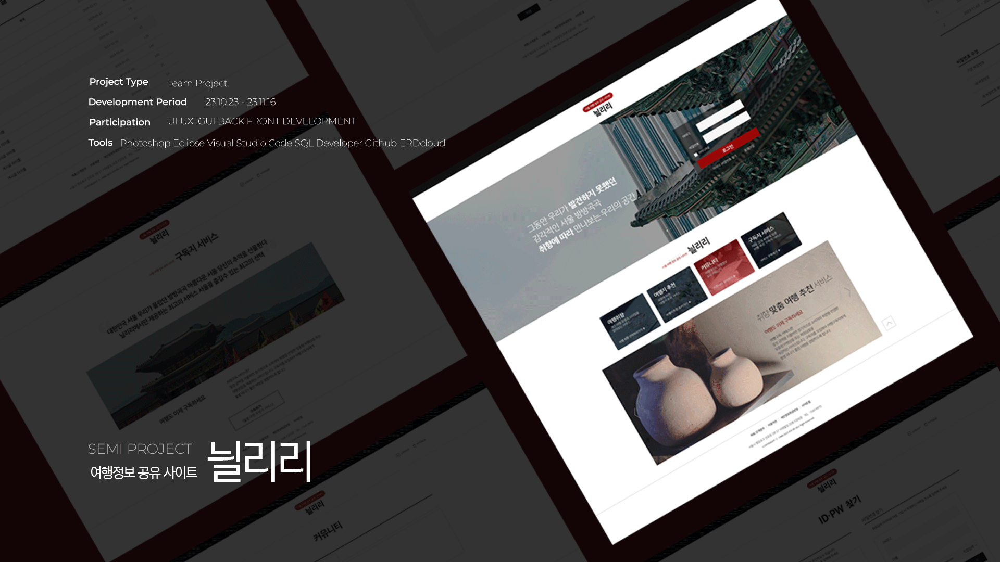

<h2>서울 여행 정보 공유 플랫폼 닐리리 </h2>

국내 서울 여행 정보 나의 취향에 맞게 쉽고 편하게 찾기 위한 공유 플랫폼입니다. 

⚙프로젝트 정보  
project type  -  team project 
프로젝트 기간 - 2023.10.10 - 2023.11.15

<h3>🖱구현기능</h3>

1. 회원가입, 로그인, 비밀번호 찾기, 아이디 찾기  
2. 회원 구독기능, 구독해지 기능  
3. 마이페이지 회원정보 상세보기, 회원 정보수정, 회원탈퇴 기능  
4. 메인페이지 로그인 영역 비회원, 회원 , 구독회원별 다른 인터페이스 구현  
5. 공지사항 게시판, QnA게시판, 커뮤니티게시판 - 썸머노트 적용, 사진첨부, 좋아요 기능구현 
6. 챗봇 기능, 취향선택 후 취향에 따라 다른 구독지 제공기능 구현  

<h3>🙋‍♀️담당 기능</h3>
1. 헤더,푸터, 메인, 서브페이지 프런트 구현 : HTML,CSS 
2. 회원가입 이용약관 모달창 구현 
3. 마이페이지 회원정보, 정보수정, 회원탈퇴 기능구현 
4. 회원구독, 구독해지 기능 구현 

